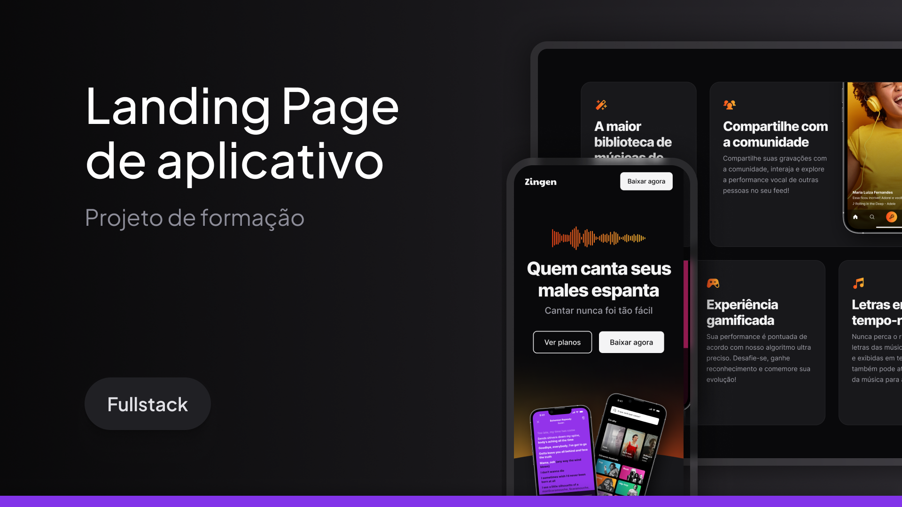

A product landing page project developed during the Responsiveness classes in the FullStack course.

<a href="#-technology">Technologies</a>&nbsp;&nbsp;&nbsp;|&nbsp;&nbsp;&nbsp;
<a href="#-project">Project</a>&nbsp;&nbsp;&nbsp;|&nbsp;&nbsp;&nbsp; <a href="#memo-license">License</a>

 

## 🚀 Technologies

This project was developed with the following technologies:

- HTML
- CSS

## Project

In this project you will develop the complete and responsive marketing Landing Page for a Karaoke application called Zingen.

We will learn several CSS techniques and how to make a project responsive.
